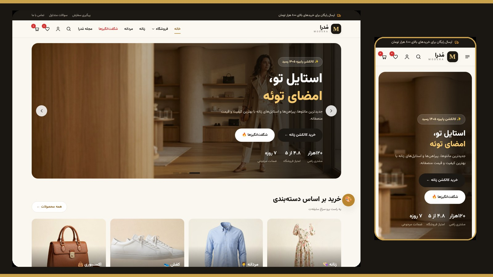
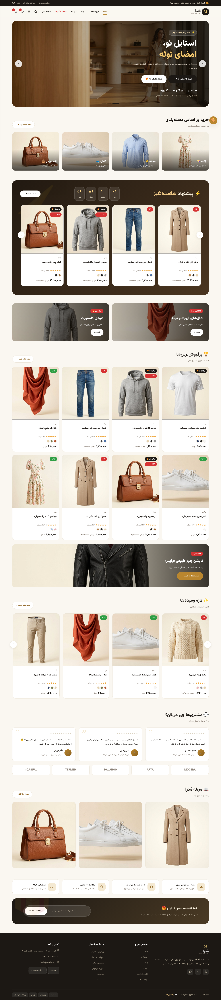
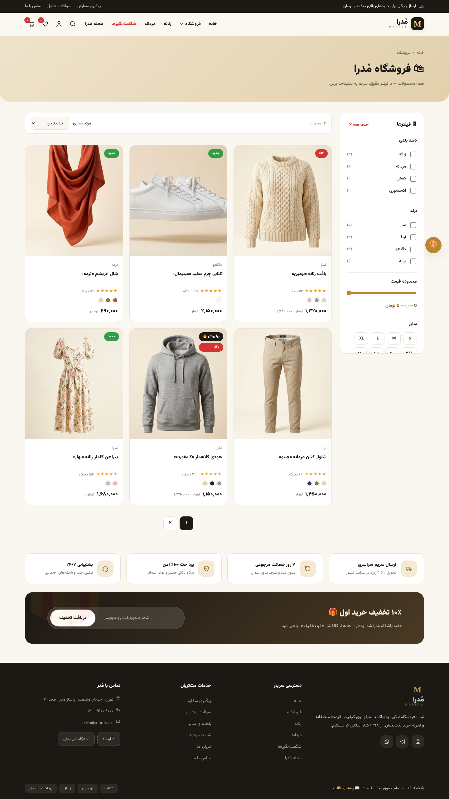
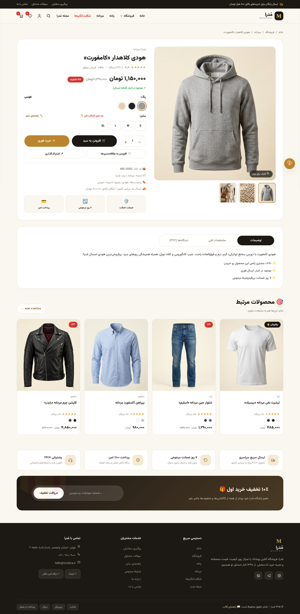

# 👗 مُدرا (MODERA) — قالب HTML فروشگاه پوشاک

قالب **راست‌چین و فارسی** فروشگاه اینترنتی لباس؛ بدون نیاز به بک‌اند، بدون هیچ وابستگی (jQuery، بوت‌استرپ و…) — فقط HTML + CSS + جاوااسکریپت خالص.

> طراحی‌شده برای فروش در مارکت‌هایی مثل **ژاکت** و **راست‌چین** + قابل اتصال به هر بک‌اند (وردپرس/لاراول/جنگو…).

## 📸 پیش‌نمایش



| صفحه اصلی | فروشگاه | محصول |
|:---:|:---:|:---:|
|  |  |  |

> همه اسکرین‌شات‌ها واقعی و به‌روزند (با `python3 tools/shots.py` دوباره ساخته می‌شن).

---

## ✨ امکانات

| بخش | امکانات |
|---|---|
| 🏠 صفحه اصلی | اسلایدر هیرو، دسته‌بندی‌ها، فروش ویژه با **شمارش معکوس واقعی**، پرفروش‌ها، تازه‌ها، نظرات مشتری، مجله |
| 🛍 فروشگاه | فیلتر دسته/برند/قیمت/سایز/رنگ، فقط تخفیف‌دارها، ۵ حالت مرتب‌سازی، صفحه‌بندی، چیپ فیلترهای فعال |
| 👕 صفحه محصول | گالری با زوم، انتخاب رنگ/سایز، **راهنمای سایز**، تب توضیحات/مشخصات/دیدگاه‌ها، ثبت نظر، محصولات مرتبط، نوار خرید چسبان |
| 🛒 سبد خرید | سایدبار + صفحه سبد، **کد تخفیف** (`WELCOME10` و `MODERA20`)، نوار پیشرفت ارسال رایگان، پیشنهاد تکمیل استایل |
| 💳 تسویه | اعتبارسنجی فارسی (موبایل/آدرس)، ۲ روش ارسال، ۳ روش پرداخت، ثبت سفارش با شماره پیگیری |
| 📦 پیگیری سفارش | تایم‌لاین مرحله‌ای وضعیت سفارش |
| 🔍 جستجو | جستجوی زنده با پیش‌نمایش نتایج + پیشنهادهای پرتکرار |
| ❤️ علاقه‌مندی | ذخیره‌سازی دائمی در مرورگر (localStorage) |
| 📱 موبایل | منوی کشویی، ناوبری پایین موبایل، کاملاً واکنش‌گرا |
| 🎨 شخصی‌سازی | **۴ پوسته رنگی** (طلایی/رز/زمردی/سرمه‌ای) با یک کلیک + فونت وزیرمتن داخلی |
| ⚙️ سئو | تگ‌های متا، Open Graph و اسکیمای `ClothingStore` |

**صفحات:** اصلی، فروشگاه، محصول، سبد، تسویه، علاقه‌مندی‌ها، پیگیری، بلاگ، درباره، تماس، سوالات متداول، ۴۰۴، راهنمای قالب (۱۳ صفحه)

---

## 📁 ساختار

```
lebass/
├── index.html  shop.html  product.html  cart.html  checkout.html  ...
├── assets/
│   ├── css/style.css        ← همه استایل‌ها (تک‌فایل)
│   ├── js/products.js       ← ★ محصولات، قیمت‌ها، کدهای تخفیف اینجاست
│   ├── js/main.js           ← موتور قالب
│   ├── img/                 ← عکس‌های دمو (۱۰ محصول، تولیدشده با هوش مصنوعی)
│   └── fonts/               ← فونت وزیرمتن (آفلاین، بدون نیاز به اینترنت)
├── screenshots/             ← اسکرین‌شات واقعی + کاور مارکت (cover.jpg)
├── tpl/                     ← سورس قالب‌ها (partials + pages)
├── tools/                   ← بیلد صفحات + اسکریپت اسکرین‌شات و کاور
├── MARKETING.md             ← ★ متن آماده آگهی فروش + استراتژی قیمت‌گذاری
├── CHANGELOG.md             ← تاریخچه نسخه‌ها
└── LICENSE.txt              ← لایسنس تک‌دامنه فارسی
```

---

## 🚀 اجرا (تک‌کلیکه ⚡)

**🌍 دموی آنلاین (لینک آماده برای مشتری): https://ahoseiny270-create.github.io/lebass/**

**روی کامپیوتر خودت — بدون نصب هیچی:**
- 🪟 ویندوز: روی `demo.bat` دابل‌کلیک کن (مرورگر خودش باز می‌شه)
- 🍎🐧 مک و لینوکس: فایل `demo.sh` رو اجرا کن
- 🖱️ یا ساده‌تر: `index.html` رو مستقیم باز کن — بدون سرور هم کامل کار می‌کنه!

**روش دستی:**

```bash
cd lebass
python3 -m http.server 8000
# بعد برو به: http://localhost:8000
```

> دموی آنلاین روی GitHub Pages فعاله و با هر پوش، خودکار به‌روز می‌شه.

### بیلد مجدد بعد از ویرایش قالب‌ها

```bash
python3 tools/build.py
```

---

## 🛠 شخصی‌سازی سریع (برای خریدار قالب)

1. **محصولات و قیمت‌ها:** فقط فایل `assets/js/products.js` را ویرایش کن.
2. **رنگ اصلی:** متغیر `--accent` در ابتدای `assets/css/style.css` (یا از پنل 🎨 دمو انتخاب کن).
3. **لوگو و نام فروشگاه:** جستجوی `مُدرا` در فایل‌ها و جایگزینی.
4. **شماره تماس/آدرس:** در `tpl/partials/footer.html` و `contact.html`، بعد `build.py` را اجرا کن.
5. **عکس‌ها:** فایل‌های `assets/img/*.jpg` را با عکس‌های خودت جایگزین کن (نسبت ۳×۴ پیشنهاد می‌شود).

---

## 💰 چک‌لیست فروش در ژاکت/راست‌چین

- [x] اسکرین‌شات‌ها آماده‌ست (پوشه `screenshots/`) — کاور اصلی: `cover.jpg`
- [x] لینک دمو فعاله: https://ahoseiny270-create.github.io/lebass/
- [ ] فایل راهنما (همین README) را داخل زیپ محصول بگذار
- [ ] نسخه‌بندی کن: `modera-v1.0.zip`
- [ ] دکمه «خرید قالب» در پنل دمو (`tpl/partials/overlays.html`) را به صفحه محصولت لینک کن

---

## 📝 لایسنس تصاویر

عکس‌های پوشه `assets/img` با هوش مصنوعی تولید شده‌اند و برای استفاده در دموی قالب آزادند. برای استفاده تجاری نهایی، جایگزینی با عکس‌های اختصاصی توصیه می‌شود.

---

ساخته‌شده با ❤️ برای فروشگاه‌های ایرانی | نسخه ۱٫۰ — پاییز ۱۴۰۵
